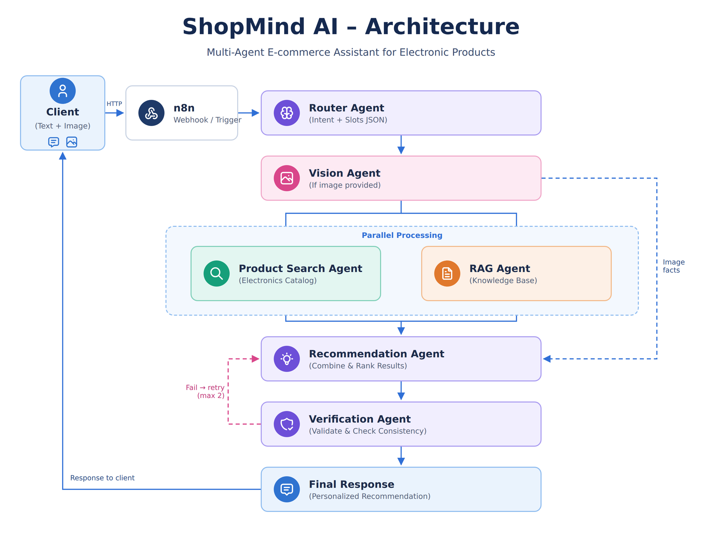

# ShopMind AI

**Multi-agent e-commerce assistant for electronic products** (laptops, smartphones, accessories), built on
**n8n**. A customer sends a question (text, optionally a photo); a team of agents understands the request,
searches a product catalog and a technical knowledge base, and returns a verified, personalized recommendation.

> Final project — Advanced Deep Learning, ESPRIT (2026–2027).
> Topics covered: prompt engineering, RAG, multi-agent systems, multimodality, automation.

## Team

| Member | Responsibility |
|---|---|
| Melek | RAG: knowledge base, retrieval pipeline, RAG Agent, evaluation |
| _name_ | Router Agent |
| _name_ | Vision Agent (multimodal) |
| _name_ | Product Search Agent (catalog) |
| _name_ | Recommendation Agent |
| _name_ | Verification Agent + orchestrator |



---

## Architecture

| Agent | Role | Status |
|---|---|---|
| Router | Classifies intent, extracts needs as JSON (budget, use case, brands) | in progress |
| Vision | Describes a customer photo (product, visible features, text) | in progress |
| Product Search | Finds matching products in the electronics catalog | in progress |
| **RAG (Knowledge)** | Finds **verified technical facts** in the knowledge base, with citations | **done** |
| Recommendation | Combines needs, products and facts into a ranked recommendation | in progress |
| Verification | Checks the recommendation against sources; retry loop (max 2) | in progress |

Each agent is an independent n8n workflow ("When Executed by Another Workflow" trigger) called by an
orchestrator workflow. Contracts (input/output JSON) are documented in each agent's prompt file.

---

## Repository structure

```
config/settings.yaml      all parameters (paths, chunking, models, retrieval, evaluation)
content/guides/           team-written buying guides (FR) — part of the knowledge base
config/*_sources.yaml     knowledge-base sources (Wikipedia list, manufacturer PDFs)
scripts/01…09_*.py        numbered pipeline: collect → clean → chunk → index → evaluate
src/shopmind_rag/         shared code: chunking, embeddings, BM25, reranking, retrieval API
tests/                    pytest suite (runs without any external service)
eval/                     frozen test set + evaluation results (evidence for the report)
prompts/                  prompt library (one file per agent, versions + observed failures)
n8n/workflows/            exported n8n workflows (one JSON per agent + orchestrator)
docs/                     architecture diagram
docker-compose.yml        Qdrant, Ollama, reranker, retrieval API, n8n
```

`data/` (raw documents, processed text, chunks, embedding cache) is **not versioned**: it is rebuilt by the scripts.

---

## Quick start

**Requirements:** Docker Desktop, Python 3.11+, ~10 GB disk. An NVIDIA GPU is recommended (the compose file
reserves it for Ollama and the reranker; remove the `deploy:` blocks to run on CPU, much slower).

```bash
git clone https://github.com/MelekJemiii/Deeplearning-ShopMind.git
cd Deeplearning-ShopMind
python -m venv .venv
.venv\Scripts\activate                    # Linux/Mac: source .venv/bin/activate
pip install -r requirements.txt
copy .env.example .env                    # Linux/Mac: cp — then fill in the values
docker compose up -d
docker compose exec ollama ollama pull bge-m3
```

| Service | URL |
|---|---|
| n8n | http://localhost:5678 |
| Retrieval API (+ interactive docs) | http://localhost:8000/docs |
| Qdrant dashboard | http://localhost:6333/dashboard |
| Reranker (TEI) | http://localhost:8081 |

Image versions are **pinned** in `.env` (`QDRANT_VERSION`, `OLLAMA_VERSION`, `N8N_VERSION`, `RERANKER_VERSION`):
the stack cannot change under you before a demo.

### Build the knowledge base

```bash
python scripts/01_download_wikipedia.py     # 43 technical articles (EN + FR)
python scripts/02_add_guides.py             # 8 team-written buying guides (FR)
python scripts/03_convert_pdfs.py           # 12 manufacturer spec sheets (PDFs in data/raw/pdf/, see config/pdf_sources.yaml)
python scripts/04_validate_testset.py       # checks the test-set labels
python scripts/05_clean.py                  # headers/footers, boilerplate, conversion noise
python scripts/04_validate_testset.py --processed   # cleaning must not remove any answer
python scripts/06_chunk.py                  # strategies A (recursive) and B (headings)
python scripts/07_embed_index.py            # bge-m3 embeddings -> Qdrant (add --hybrid for BM25 collections)
docker compose up -d --build rag-api
```

### Evaluate

```bash
pytest -q
python scripts/08_evaluate.py --strategies A B --modes dense hybrid dense_rerank hybrid_rerank
python scripts/09_evaluate_agent.py         # end-to-end agent evaluation via the n8n webhook (resumable)
```

---

## RAG component (knowledge base + RAG Agent)

### Corpus — 63 documents, ~222k words after cleaning

| Source | Docs | Why |
|---|---|---|
| Wikipedia (EN + FR) | 43 | Definitions and technical background (RAM, GPU, USB-C, OLED, Thunderbolt…) |
| Team-written guides (FR) | 8 | Practical advice per use case (data science, gaming, students…) — what Wikipedia does not give |
| Manufacturer spec sheets | 12 | Exact specs (Lenovo PSREF, HP, Dell), page-selected to drop warranties and legal text |

Cleaning removed 17% of PDF content (repeated headers, boilerplate) with **0 answer evidence lost**, verified
against the test set.

### Chunking — two strategies compared

- **A — recursive:** 500 tokens, 50 overlap, structure-blind
- **B — headings:** one chunk per section, prefixed with its heading path
  (`Legion 5 > PERFORMANCE > Graphics`), small sections merged, tables never split

Same maximum size for both, so the comparison isolates one variable: structure awareness.

### Retrieval pipeline (final)

```
question -> bge-m3 dense search (top 20, Qdrant) -> bge-reranker-v2-m3 cross-encoder (top 5) -> RAG Agent
```

Embeddings run locally (Ollama, GPU): free, unlimited, no data sent out. Chosen after the Gemini
embedding free tier (1,000 requests/day) blocked indexing.

### Retrieval evaluation — 31 queries (FR/EN), frozen before chunking

| Setup | Hit@1 | Hit@5 | MRR |
|---|---|---|---|
| A — recursive, dense | 20/28 | 26/28 | 0.810 |
| B — headings, dense | 23/28 | 27/28 | 0.882 |
| B — hybrid (dense + BM25, RRF) | 21/28 | 28/28 | 0.854 |
| **B — dense + reranker (selected)** | **24/28** | **28/28** | **0.923** |

Key findings:
- **Structure-aware chunking wins** because it protects small, high-value documents (the guides) from being
  drowned by large generic ones (Wikipedia is 87% of the corpus).
- **Hybrid search raises recall but hurts precision:** every chunk of a spec sheet repeats the product name in
  its heading path, so BM25 cannot tell sections apart. Its scores also break the "no answer" threshold.
- **Reranking gives both:** best Hit@1 and MRR, every answer in the top 3, and its score separates
  unanswerable questions from real ones (cosine similarity does not).

Full tables, per-query results and misses: [`eval/results/summary.md`](eval/results/summary.md).

### RAG Agent (n8n)

A real agent, not a single LLM call: it plans 1–3 technical questions, **chooses** which part of the
knowledge base to search (guides, spec sheets, Wikipedia) and with which query, judges the results, stops or
retries, and returns cited facts. Tool: `POST /search` on the retrieval API.

Three layers of protection:
1. **Prompt rules** — grounding, search budget, knowledge-base scope (no prices / stock / repairs)
2. **Citation check (code)** — a fact citing a chunk the tool never returned is removed
3. **Number check (code)** — a fact containing a number absent from its cited chunk is removed

The summary sent to the Recommendation Agent is **built by code from verified facts only** (LLM summaries
drifted in tests, with both Gemini and gpt-oss).

Chat model: Gemini Flash, with automatic **fallback** to Groq `openai/gpt-oss-120b` (different provider,
separate quota); the model that answered is logged (`model_used`). Both models pass the four tests below
under the same prompt and guardrails.

| Test | Result |
|---|---|
| T1 — laptop for data science | ✅ one search per question, 0 invalid citations |
| T2 — "Legion 5 USB-C charging?" (FR question, EN spec sheet) | ✅ spec sheet filter, English query |
| T3 — "iPhone 16 price?" (not in the KB) | ✅ `not_found`, 0 searches, nothing invented |
| T4 — gaming screen (a query plain retrieval missed) | ✅ found via the agent's guide filter |

Prompt versions v1→v4 with every observed failure and fix: [`prompts/P6_rag_agent.md`](prompts/P6_rag_agent.md).
End-to-end evaluation over the 31 queries: [`eval/agent_results/summary.md`](eval/agent_results/summary.md).

**Output contract** (consumed by the Recommendation Agent):
```json
{
  "questions": [{"question": "...", "status": "answered | not_found",
                 "facts": [{"fact": "...", "chunk_id": "guide_001#B001", "source_title": "..."}]}],
  "summary_for_recommender": "verified facts only",
  "searches_made": 2,
  "model_used": "primary: gemini | fallback: groq openai/gpt-oss-120b",
  "validation": {"removed_invalid_citations": [], "removed_number_mismatch": [], "...": "..."}
}
```

---

### Known limitations

- 31 test queries (28 in-scope): differences of 1–3 queries are trends, not statistical proof.
- Fact wording is written by the LLM; citations and numbers are verified in code, wording strength is not
  (left to the Verification Agent).
- Out-of-scope detection relies on the agent's scope rule and the reranker-score floor, tested on 3 queries.
- Free-tier LLM APIs limit how many end-to-end runs fit in a day; the agent evaluation is resumable for that reason.

---

## Contributing (team workflow)

- Never push directly to `main`: create a branch (`feature/router-agent`), push it, open a Pull Request.
- One owner per n8n workflow file: n8n JSON does not merge well.
- Never commit `.env` or API keys. Check exported workflows before committing.
- Each agent documents its prompt in `prompts/` using the same format as `P6_rag_agent.md`.

## Licensing notes

- Wikipedia content: CC BY-SA 4.0 (attribution in `data/kb_metadata.csv`).
- Manufacturer PDFs: public documents used for academic purposes; not redistributed (excluded from git).
- `pymupdf4llm` / PyMuPDF is AGPL-3.0: fine for this academic project; a commercial deployment would need a
  commercial license or another converter (the conversion is isolated in `scripts/03_convert_pdfs.py`).
